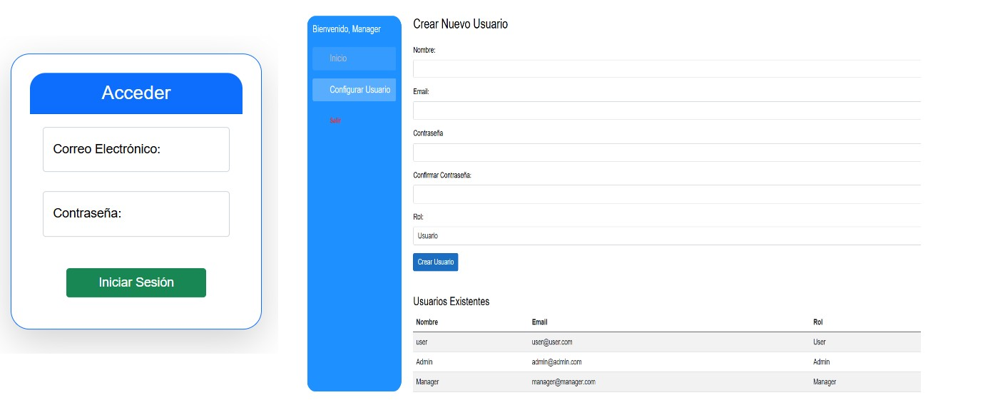

# Proyecto de Gestión de Usuarios con Blazor y Microsoft Identity

Este es un proyecto de gestión de usuarios utilizando Blazor WebAssembly, Microsoft Identity y SQL Server. Permite la creación y gestión de usuarios con roles específicos como "Admin" y "Manager", además de un sistema de autenticación basado en Identity de Microsoft.

## Características

- **Autenticación y autorización**: Implementación de autenticación usando Microsoft Identity y roles personalizados (Admin, Manager, User).
- **Creación de usuarios**: Solo los usuarios con roles de Admin o Manager pueden crear nuevos usuarios. Los Admin pueden crear cualquier rol, mientras que los Managers solo pueden crear usuarios con el rol de Manager.
- **Interfaz intuitiva**: Diseño simple y claro para la gestión de usuarios.
- **Base de datos**: Se usa SQL Server como base de datos para almacenar la información de los usuarios.

## Tecnologías utilizadas

- **Blazor**: Framework para la creación de aplicaciones web interactivas y modernas en C#.
- **Microsoft Identity**: Proporciona una solución robusta para autenticación y autorización de usuarios.
- **SQL Server**: Base de datos utilizada para almacenar información de usuarios y roles.
- **ASP.NET Core**: Plataforma para crear aplicaciones web y servicios.
- **Entity Framework Core**: ORM que facilita la interacción con la base de datos.

## Funcionalidades

1. **Login**: Los usuarios pueden iniciar sesión utilizando sus credenciales, con roles asignados.
2. **Creación de usuario**: Los administradores y managers pueden crear nuevos usuarios, asignándoles roles específicos.
3. **Vista de usuarios**: Los administradores pueden ver una lista de todos los usuarios en el sistema.
4. **Restricciones de acceso**: Los usuarios solo pueden acceder a las funcionalidades que su rol les permita.

## Instalación

Para ejecutar este proyecto en tu máquina local, sigue los siguientes pasos:

1. Clona el repositorio:
   ```bash
   git clone https://github.com/tu-usuario/nombre-del-repositorio.git
